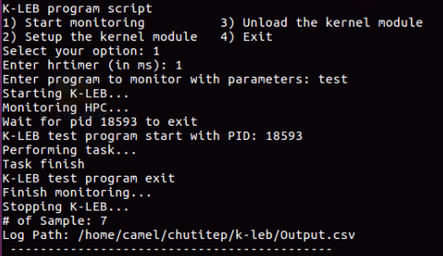

# K-LEB (Kernel - Lineage of Event Behavior)
#### K-LEB is a kernel module designed to monitor hardware events from a kernel level. 

#### It implements three key features:

1. The ability to send this event info back to user space
2. The ability to keep the event recording process specific
3. The ability to monitor events periodically with a high-resolution kernel timer

## Supported Kernel
The current build is tested on Linux Kernel 6.2.0-26 and earlier

## Supported Processors
This version of K-LEB supports Intel/x86 processors up to core i7 with hardware performance counters

# Setup

#### Prerequisite 
Install essential development tools and the kernel headers 
```
 apt-get install build-essential linux-headers-$(uname -r)
```

### Apply the module (command line):

- Run the following commands:
```
make clean; make
sudo insmod kleb.ko
dmesg
sudo mknod /dev/kleb c <major number> 0
```

- To get your device's major number you can run:
```
dmesg | grep -i major
```


### Apply the module (with the script):
-  Run: 
```
sudo bash initialize.sh
```
- Select option: 2) Setup
    - The script will automatically insert K-LEB kernel module to the kernel.
    
# Getting started

### Use the module (command line)

- To start monitoring using the kernel module, run the following bash command:
```
sudo ./ioctl_start -e <Event1>,<Event2>,<Event3>,<Event4> -t <timer delay (in ms)> -o <Log path> <program path>
```

Users can specify the program to monitor using \<Program PATH\> or \<Program PID\>, as well as supply program parameters, if applicable.

Users can specify the whole system monitoring by using option -a

Users can specify the hardware events they want to monitor.

Example of a successful run:


Please note: there are three fixed hardware events that will be monitored, which are instructions retired, Cycles when the thread is not halted, and Reference cycles when the thread is not halted, in addition to the ones specified on the command line (programmable hardware events). 

- After finish monitoring, HPC data is logged and stored in Output.csv in the current directory or in \<Log path\>

Here is what the output file may look like:


### Use the module (with the script)

Run initialize.sh using the configuration file perf.cfg for events selection

#####  perf.cfg:

> \<HPC Event1\> <br>
\<HPC Event2\> <br>
\<HPC Event3\> <br>
\<HPC Event4\> <br>

Users can change the perf.cfg file to select the hardware events they want to monitor.

Please note: there are three fixed hardware events that will be monitored, which are instructions retired, Cycles when the thread is not halted, and Reference cycles when the thread is not halted, in addition to the ones specified on the command line (programmable hardware events). 

To start monitoring using the kernel module, run:
```
sudo bash initialize.sh
```
- Select option: 1) Start

- Enter timer granularity in ms

- Select program to monitor using \<Program PATH\> or \<Program PID\>, as well as supply program parameters, if applicable. 

Here is an example of a run from the script:



After finish monitoring, HPC data is logged and stored in Output.csv in the current directory or in \<Log path\>

### Monitoring a running program

To monitor the on-running programs such as web servers, Docker containers, etc. User can pass the program process id to K-LEB.

#### How to obtain the process id

- For Docker container:
```
docker top <container name>
```


- For other programs:
```
pgrep <process name>
```


Here is an example of a run using program process id:


Press Ctrl+C to stop monitoring, HPC data is logged and stored in Output.csv in the current directory or in \<Log path\>:


# Unload the Module

### Unload with Command Line

- Run the following commands:
```
make clean
sudo rm /dev/kleb
sudo rmmod kleb
```

### Unload with Script

- Run the script with:
```
sudo bash initialize.sh
```

- Select option: 2) Clean
    - The script will automatically unload K-LEB kernel module from the kernel.
    
# Citing

For more technical details please refer to the following paper:
```
@inproceedings{ woralert2020hpc,
       author={Woralert, Chutitep and Bruska, James and Liu, Chen and Yan, Lok},
       title={High Frequency Performance Monitoring via Architectural Event Measurement},
       booktitle={IEEE International Symposium on Workload Characterization},
       year={2020}
       }
```
