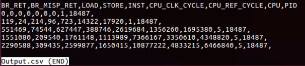

# K-LEB (Kernel - Lineage of Event Behavior)
##### K-LEB is a kernel module designed to monitor hardware events from a kernel level. 

##### It implements three key features:

1. The ability to send this event info back to user space
2. The ability to keep the event recording process specific
3. The ability to monitor events periodically with a high resolution kernel timer

## Supported Kernel
Linux Kernel 4.13.0-15 and earlier

## Supported Processors
Currently K-LEB supports Intel/x86 processors with hardware performance counters only

# Setup

#### Prerequisite 
Install essential development tools and the kernel headers 
```
 apt-get install build-essential linux-headers-$(uname -r)
```

### Apply the module (command line):

- run the following commands:
```
make clean; make
sudo insmod kleb.ko
dmesg
sudo mknod /dev/kleb c <major number> 0
```

### Apply the module (using script):
-  Run: 
```
sudo bash initialize.sh
```
- select option: 2) Setup
    - The script will automatically compile and insert K-LEB kernel module to the kernel.
    
# Getting started
Run initialize.sh using the configuration file perf.cfg for events selection

##### ex perf.cfg:

> \<HPC Event1\> <br>
\<HPC Event2\> <br>
\<HPC Event3\> <br>
\<HPC Event4\> <br>
	
To automatically start monitoring, run:
```
sudo bash initialize.sh
```
- select option: 1) Start

- Enter timer granularity in ms

- Select program to monitor using \<Program PATH\> or \<Program PID\>

Shown here is what a sucessful run will look like:


Here is what it will look like when it is done monitoring:


Here is what the output file may look like:


		
- To manually start monitoring, run the following bash command:
```
sudo ./ioctl_start <Event1> <Event2> <Event3> <Event4> <timer delay (in ms)> <Log path> <program path>
```

- After finish monitoring, HPC data is logged and stored in Output.csv in the current directory or in \<Log path\>


